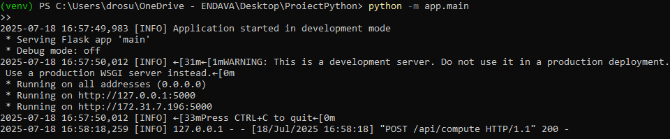
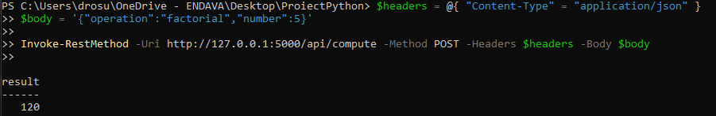

## Project Summary

This project is a simple, modular microservice built with Python and Flask that exposes an API for basic math operations: factorial, fibonacci, and power. The logic is cleanly separated into services, routes, models, and database layers.

Input validation is handled using Pydantic, and each request is stored in a local SQLite database. The project includes unit tests with pytest, code style checks with flake8, and a Dockerfile for easy containerization.

CI/CD is set up via GitHub Actions to automatically run tests and lint checks on every push. The result is a small, functional, and well-structured microservice that’s easy to run, test, and deploy.


##  Features

- REST API built with Flask
- Input validation using Pydantic
- SQLite database to log all requests
- Modular architecture (views, services, models, database)
- Unit testing with pytest
- Code linting with flake8
- Docker containerization
- GitHub Actions CI workflow on every push

---

##  Project Structure

```
ProiectPython/
├── app/
│ ├── main.py # App entry point
│ ├── views.py # Route handling
│ ├── services.py # Math logic
│ ├── models.py # Pydantic + ORM models
│ ├── database.py # SQLite setup
├── tests/ # Unit tests with pytest
├── .github/workflows/ci.yml # CI pipeline
├── requirements.txt
├── Dockerfile
├── .env
└── README.md
```

## Getting Started

To run the project locally:

1. Clone the repository:
   ```bash
   git clone https://github.com/RosuDaniel23/math-microservice.git
   cd math-microservice
    ```
2. Create and activate a virtual environment:
   ```bash
   python -m venv venv
    .\venv\Scripts\activate  # On Windows
    source venv/bin/activate  # On macOS/Linux
   ```
3. Install the dependencies:
   ```bash
   python -m pip install -r requirements.txt
   ```
4. Run the application:
   ```bash
   python -m app.main
    ```
The API will be available at: ```http://127.0.0.1:5000/api/compute```

##  Quality Checks

You can run the following locally:

- Lint with flake8:
  ```bash
  python -m flake8 app/

- Unit tests with pytest:
  ```bash
  python -m pytest
  ```
 ## Future Improvements

Here are some features and technical improvements that could enhance the project further:

- **Asynchronous processing**: Use async workers (e.g. Celery with Redis) to offload heavy computations.
- **Caching**: Store results for repeated inputs using Redis or in-memory caching to reduce compute time.
- **Authentication**: Add support for API key or JWT-based authentication to protect the endpoint.
- **Testing coverage report**: Track test coverage and enforce thresholds.
- **Monitoring & metrics**: Add a `/metrics` endpoint using `prometheus_client` for integration with Grafana.
- **Multi-operation support**: Accept and process batch requests with multiple operations in a single API call.
- **Deployment**: Automate deployment to a cloud platform like Heroku, Railway, or a VPS with Docker Compose.

## Demo

Below is a simple demonstration showing that the microservice works as expected:


###  Sending a request via PowerShell

We sent a request using `Invoke-RestMethod` with the following JSON body:

```json
{
  "operation": "factorial",
  "number": 5
}
```
### The result was correctly returned:
   
